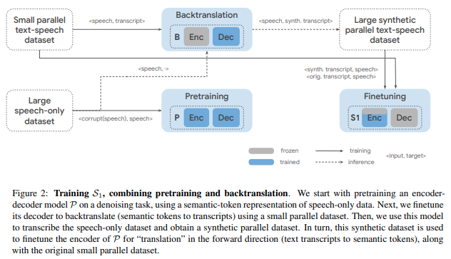

</img>

## Spear-TTS - Pytorch

Implementation of <a href="https://arxiv.org/abs/2302.03540">Spear-TTS</a> - multi-speaker text-to-speech attention network, in Pytorch

The text-to-semantic module built here will be used for <a href="https://github.com/lucidrains/soundstorm-pytorch">SoundStorm</a> for conditioning.

## Appreciation

- <a href="https://stability.ai/">Stability</a> for their generous sponsorships to work on and open source cutting edge artificial intelligence research

- <a href="https://github.com/lucasnewman">Lucas Newman</a> for completing the <a href="https://github.com/lucidrains/spear-tts-pytorch/pull/4">backtranslation</a> portion, as well as beam search decoding!

- <a href="https://github.com/lucasnewman">Lucas Newman</a> for completing the final text to semantic transformer training code!

## Install

```bash
$ pip install spear-tts-pytorch
```

## Usage

```python
import torch

from audiolm_pytorch import HubertWithKmeans

from spear_tts_pytorch import (
    TextToSemantic,
    SemanticToTextDatasetGenerator,
    GeneratedAudioTextDataset,
    MockDataset
)

wav2vec = HubertWithKmeans(
    checkpoint_path = './hubert_base_ls960.pt',
    kmeans_path = './hubert_base_ls960_L9_km500.bin'
)

model = TextToSemantic(
    wav2vec = wav2vec,
    dim = 512,
    num_text_token_ids = 256,
    source_depth = 1,
    target_depth = 1
)

ds = MockDataset(10)

dataset_generator = SemanticToTextDatasetGenerator(
    model = model,
    dataset = ds,
    folder = './output_folder'
)

dataset_generator(max_length = 2)

generated_dataset = GeneratedAudioTextDataset(
    folder = './output_folder'
)

assert len(generated_dataset) == 10
```

## Todo

- [x] add eos logic + generate, and hook up end-to-end generation in soundstorm
- [x] add first pretraining speech-to-speech with the reconstruction of 60% deleted tokens
- [x] add dropouts for this project, as low-resource
- [x] add total flexiblity of which layers of encoder / decoder to freeze during training
- [x] add step for training on small speech -> text corpus and generating pseudo-labelled dataset + finetuning (thanks to @lucasnewman)
- [x] add final step of finetuning on text -> speech + pseudolabelled dataset
- [x] figure out the best way to store and manage the pseudo-labelled generated dataset
- [x] batched beam search decoding

- [ ] allow for using rotary positions in decoder + flash attention, give Tri another citation
- [ ] polish the audio-text generation workflow
- [ ] concatting the real audio-text dataset with the generated one -> or being able to convert real audio-text dataset to generated
- [ ] see if one can speed up text-to-semantic transformer with NAR (perhaps maskgit style, or some AR / NAR hybrid) - also start toying around with speculative decoding

## Citations

```bibtex
@misc{kharitonov2023speak,
    title   = {Speak, Read and Prompt: High-Fidelity Text-to-Speech with Minimal Supervision}, 
    author  = {Eugene Kharitonov and Damien Vincent and Zalán Borsos and Raphaël Marinier and Sertan Girgin and Olivier Pietquin and Matt Sharifi and Marco Tagliasacchi and Neil Zeghidour},
    year    = {2023},
    eprint  = {2302.03540},
    archivePrefix = {arXiv},
    primaryClass = {cs.SD}
}
```
